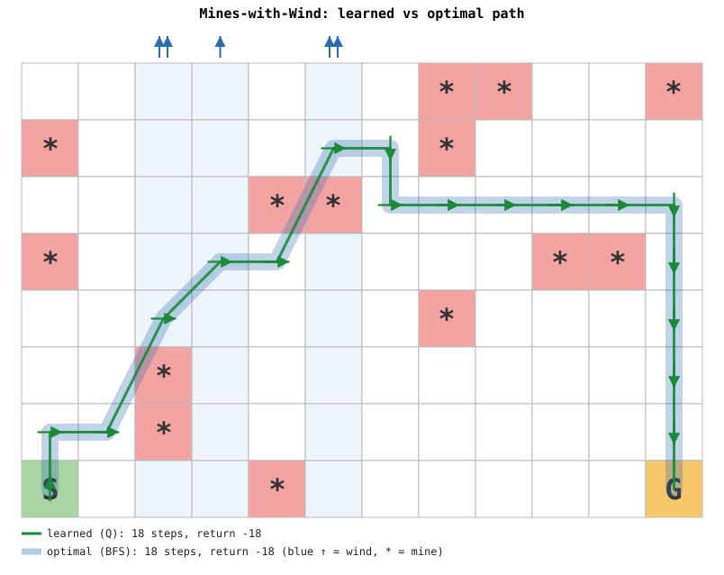
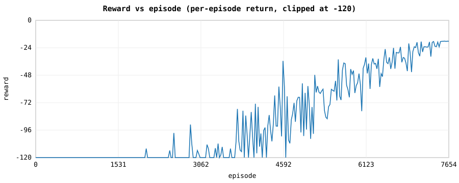
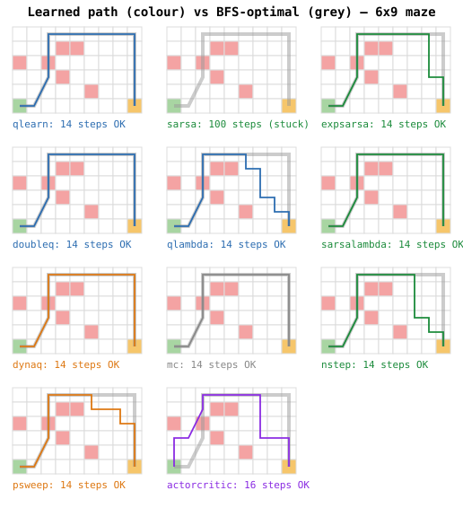
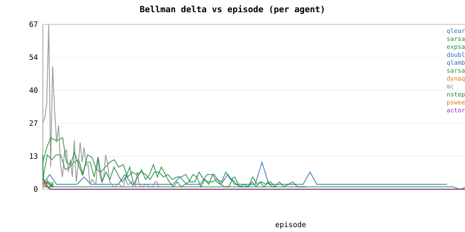
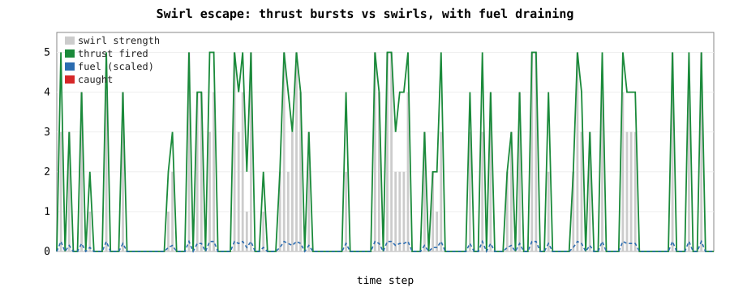
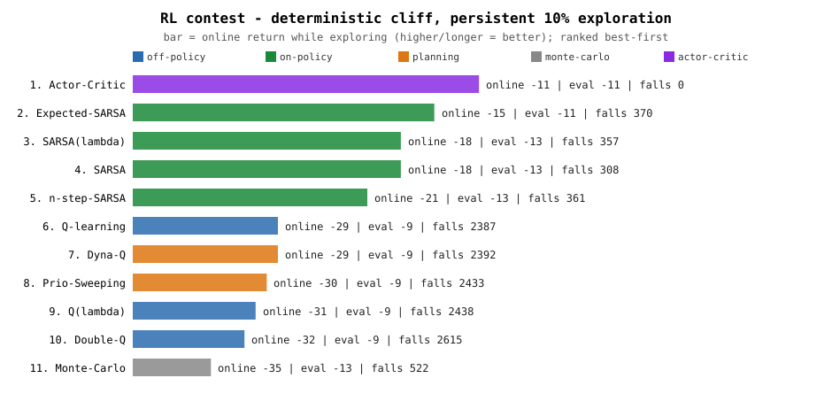
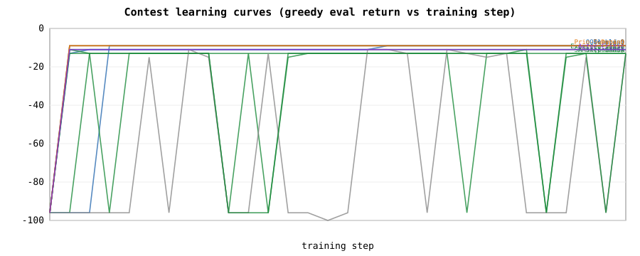
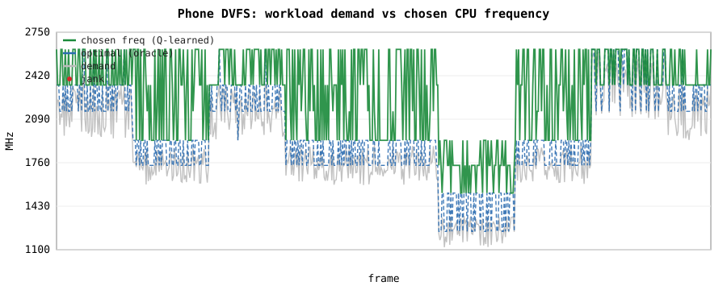

# 🧠 qlearn_int_minimal

**Pure-integer reinforcement learning in C** — one tiny agent, eleven classic
algorithms, six worlds, zero floating point. Driven entirely from a terminal
menu.

---

## ▶️ Run it

```sh
./play.sh
```

One interactive menu, four questions, and you're off:

> **① how to show it** → `Scoreboard (table)` · `Plot (SVG)` · `Path visualizer (SVG)`
> **② which world** → `windy maze` · `cliff arena` · `frozen lake` · `shifting maze` · `swirl escape` · `phone tuner` · `contest`
> **③ which agent(s)** → `all` (rank them) · or one of the **11 algorithms**
> **④ grid size** → `small` · `medium` · `large` · `custom`

No `make`, no dependencies beyond a C compiler (+ `python3` for the SVGs).
*(On this machine use `CC=gcc-12 ./play.sh`.)*

---

## 🎬 Sample sessions

Each session below is a set of menu picks and the picture it produces.

### 🟢 `Plot · windy maze · medium` — what one agent learned
The learned greedy path (**green**) lands exactly on the DFS/BFS-optimal route
(**grey**), threading the mines `*` and the per-column wind:



…and its reward climbs to the optimum and holds:



### 🔵 `Path visualizer · medium` — all 11 agents at once
Every algorithm's learned path vs the DFS-optimal, side by side — see who finds
the optimum and who wanders:



…with each agent's **Bellman-δ** collapsing toward zero as it converges:



### 🟣 `Plot · swirl escape` — beating the oracle under a noisy sensor
The craft fires **thrust bursts** to escape swirls and coasts when calm. The
swirl strength is only a *noisy reading*, so the agent learns to **hedge** —
and beats the reactive "match the reading" oracle (0% caught vs 26%):



### 🟠 `Scoreboard · contest` — the 11-algorithm cliff contest
All agents ranked on a slippery cliff. On-policy methods stay safe while
exploring; off-policy/planning learn the optimal edge path but fall more —
the textbook Sutton & Barto result, in integers:




### 📱 `Plot · phone tuner` — the real target (CPU frequency control)
Frequency **tracks the workload** — bursting to avoid jank, dropping to save
power — matching the oracle's jank at ~90% of always-max energy:



---

## 🔌 Beyond the menu

- **Scripting:** `runner <env> <agent|all> [rows cols mines]` runs any single
  combo, e.g. `./runner swirl all` (rank every agent on the swirl task).
- **Drop into a real controller:** the agent is a plug-and-play, init-once,
  integer module for an async CPU-frequency tuner — see
  [`tunner/tuner_plug_example.c`](tunner/tuner_plug_example.c).
- **Go deeper:** [`docs/rl/README.md`](docs/rl/README.md) (the 11 algorithms +
  contest) · [`docs/q-learning.md`](docs/q-learning.md) (the theory).

Pure integer (Q8.8), dependency-free, verified **no `float`/`double` anywhere**.
